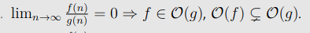

# Übung 1

Grundsätzliches:
1. Ihr erreicht mich gut per Mail: `lknirsch@student.ethz.ch`. Ich helfe gerne!
2. Bitte schreibt sinnvollen Code:  
   1. Kommentare
   2. Keine wilden Sachen wie `goto`
   3. Sinnvolle Namen für Variabeln (kein `int temptemp = 42;`)
3. Bonus: Ist eine geschenkte Viertelnote und sollte auf jeden Fall angepeilt werden!
4. Github-Repo: https://github.com/LeonardKnirsch/FS22-DnA
5. Theorieaufgaben: LaTeX und Markdown, falls ihr wollt könnt ihr auch Bilder hochladen (solange lesbar)

## Big-O notation

Hier die "genaueste" Grenze angeben, das heisst ohne Vorfaktor.  
Beispiel 1: $f(n) = 3n$, schreibe $f \in \mathcal{O}(1)$ und nicht $f \in \mathcal{O}(3)$.

## Asymptotic Growth
Diese Aufgabe kommt häufig an Prüfungen. Meistens kann man die Abhängigkeiten gut erkennen, alternativ kann man mit diesem Theorem und der Regel von d'Hopital arbeiten: 

## The set Theta

Wähle $f(n)=4$ und $g(n)=sin(n) + 2$ und zeige, dass die Defintion nicht erfüllt werden kann.

## Some proofs

Falls ihr etwas als falsch zeigen wollt, reicht ein Gegenbeispiel. 

## Code Snippets Running Times

Diese Aufgabe kommt häufig an Prüfungen. Hier musst du insbesondere die for-loops genau anschauen. 

## Prefix Sum in 2D 

Hier würde ich wie folgt vorgehen (es gibt natürlich noch andere Methoden):
1. Constructor der Klasse implementieren: Präfixsummenmatrix erstellen, diese befüllen, dabei folgende Fälle unterscheiden:
* `i >  0 && j >  0` (d.h. Feld nicht am Rand)
* `i == 0 && j >  0` (d.h. Feld an Kante)
* `i >  0 && j == 0` (d.h. Feld an Kante)
* `i == 0 && j == 0` (d.h. Feld in Ecke)
2. Implementation von `sum`: Dies sollte nun in konstanter Zeit möglich sein. Auch hier wieder die gleichen Fälle wie oben unterscheiden. 
 
**Wichtig: Falls `sum` nicht in konstanter Zeit ist (d.h. mit for-Loops), gibt es keine Punkte!**
